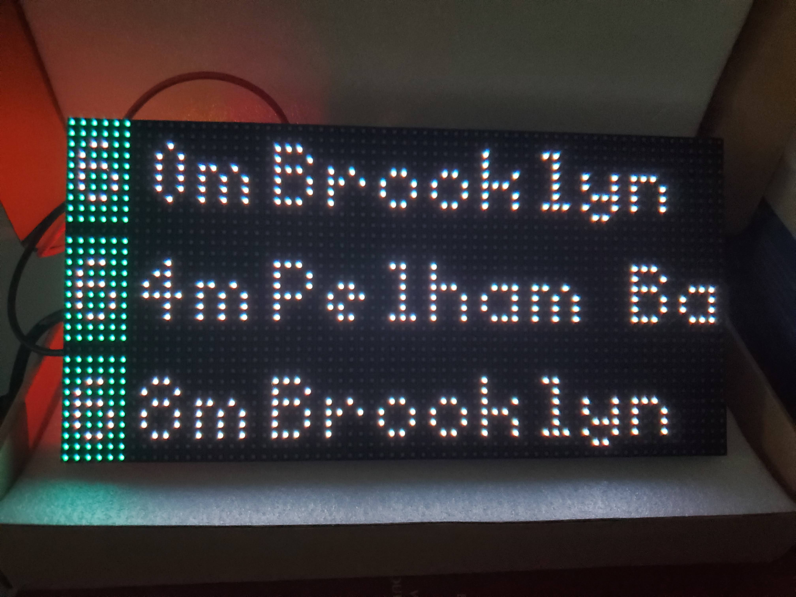

# Hardware:
* Parts List: https://github.com/riffnshred/nhl-led-scoreboard/wiki/Hardware
* Step by Step Guide: https://github.com/riffnshred/nhl-led-scoreboard/wiki/Step-by-step-guide.

I highly reccomend you read the guide above for all the details of how to set up the LED matrix, and the parts/skills required.

# Software:
Installation:
```bash
./scripts/install.sh
```

List all stops available:
```bash
get clone git@github.com:versi786/subway-led-matrix.git
cd ./subway-led-matrix
./scripts/install.sh

echo MTA_API_KEY=XXXXXXXXXXXXXXXXXXXXXXXX >> .env
```

The easiest way to find the stops you care about is by using `grep` for example:
```bash
sudo python3 -m main \
    --list-stops \
    | grep -i 'grand central'
```


Running the script, provide whatever stops you like from the output of the previous script:
```bash
sudo python3 -m main \
    --led-rows=32 \
    --led-cols=64 \
    --led-gpio-mapping=adafruit-hat-pwm \
    --led-brightness=20 \
    --led-slowdown-gpio=4 \
    --stop 'Grand Central-42 St' \
    --stop 'World Trade Center'
```

The script must be run as sudo to access the Raspberry Pi's GPIO functionality. For more details on the RGB Matrix check out the library's README here for how to change the matrix parameters [here](https://github.com/hzeller/rpi-rgb-led-matrix#changing-parameters-via-command-line-flags)


# Deploy
In order to set up the script to run automatically you can follow the instructions to set up supervisord [here](https://github.com/riffnshred/nhl-led-scoreboard/wiki/Step-by-step-guide.#step-7---now-to-run-it).

I have the following configuration in `sudo nano /etc/supervisor/conf.d/subway.conf`
```
[program:subway]
command=python3 -m main
    --led-rows=32
    --led-cols=64
    --led-gpio-mapping=adafruit-hat-pwm
    --led-brightness=20
    --led-slowdown-gpio=4
    --stop 'Grand Central-42 St'
    --stop 'World Trade Center'
directory=/home/pi/subway-led-sign
autostart=true
autorestart=true
```

# References:
 * Jeff Kessler's talk at Transportation Camp Philadelphia: [video](https://www.youtube.com/watch?v=LCIu4zbSNho)
 * [nolanbconaway/underground](https://github.com/nolanbconaway/underground)
 * [fsargent/BARTSign](https://github.com/fsargent/BARTSign)
 * [MLB-LED-Scoreboard/mlb-led-scoreboard](https://github.com/MLB-LED-Scoreboard/mlb-led-scoreboard)
 * [riffnshred/nhl-led-scoreboard](https://github.com/riffnshred/nhl-led-scoreboard)
